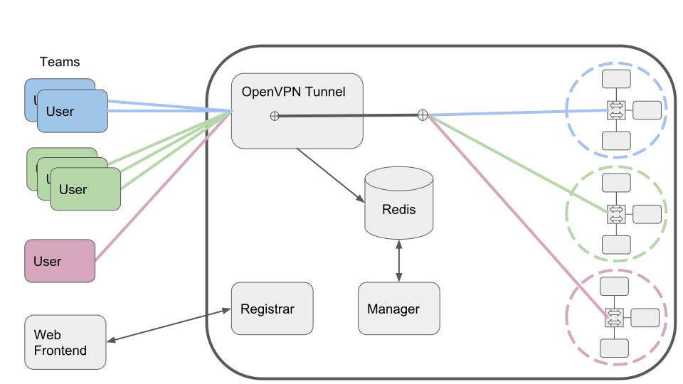

# Naumachia
Play some challenges! https://www.naumachiactf.com/

[](https://discord.gg/gH9ZgeT)

If you are interested in using or contributing to this project let me (nategraf) know! It will grow
based on input from those who care to give it.

### A multi-tenant network sandbox for security challenges

**The ambition of [Naumachia](https://en.wikipedia.org/wiki/Naumachia)** is to enable the deployment
of multi-host interactive exploit challenges for fun and non-profit. The origonal inspiration was to
enable network exploit challenges. The main target is providing fun and challenging exercises for
CTFs and classrooms.

The inspiration for this project comes from my love of networking and especially network security. I
wanted a platform to write and play challenges where everything was in-bounds including ARP
spoofing, VLAN hopping (WIP), DNS poisoning, SNMP attacks as well as destructive attacks like
dropping database tables and installing backdoors without interferring with other users. Naumachia
is a system I came up with to do just that.

Naumachia provides:
* Orchastration of "arbitrary" networks and hosts for challenges
* Isolation of teams within dedicated challenge instances
* "Full" ethernet access to the challenge network

The quotes around "full" and "arbitrary" indicate that this is not completely true, due to
limitations tracked in GitHub issues and which are ongoing areas of development.

Access to a Naumachia-hosted challenge is achieved through an OpenVPN tunnel created for that
challenge. The user is autheticated by a certificate and key-pair downloaded from the CTF website
(or other authenticated web frontend) and generated by the Naumachia registrar. Upon connection, the
VPN tunnel will place the connection information in a Redis database, and the manager will then
create a challenge instance for that user if one is not already alive. The manager will then create
a network path for the user to the challenge and the user can start playing! When the user leaves
for a while, their challenge instance will be torn down to free up resources. Data can be persisted
on a per-instance basis allowing things such as modified database state, a persistant backdoor, or
other progress to be saved between user sessions.



Challenges are specified through [Docker Compose config files] (`docker-compose.yml`)

Docker was chosen to make each challenges instance cheap to host and each to turn up and tear down,
however Naumachia could be extended to support VMs through support of Vagrantfile or another
orchastration format. Without a use case that requires this, development is not being done on this
feature.

[Docker Compose config]: https://docs.docker.com/compose/compose-file/

## Deployment

### Initial Setup
1. Obtain a Linux server (tested on Ubuntu 16.04 and 18.04). This can be, for example, a VM from for
   favorite IaaS provider (e.g. AWS, GCP, Digital Ocean..... Azure)
2. Install [Docker] and [Docker Compose]
3. Clone Naumachia source from here (https://github.com/nategraf/Naumachia.git)
4. Install requirements.txt for Python3 (`pip3 install -r requirements.txt`)

[Docker]: https://docs.docker.com/engine/installation/
[Docker Compose]: https://docs.docker.com/compose/install/

### Add your challenges

Write some challenges (see below) or clone an existing repository into your challenges directory.

### Set your configration

Setup a `config.yml` file for your challenges and run `./configure.py`. See [`config.example.yml`].

[`config.example.yml`]: https://github.com/nategraf/Naumachia/blob/master/config.example.yml

### Run it!
To run Naumachia simply bring up the environment with the [Docker Compose CLI] (e.g. `docker-compose up`)

[Docker Compose CLI]: https://docs.docker.com/compose/reference/overview/

## How to Create a Challenge

Challenges in Naumachia are defined by a `docker-compose.yml` file and the resources it launches

Consider the example provided as [example/docker-compose.yml](https://github.com/nategraf/Naumachia/blob/master/challenges/example/docker-compose.yml)

For examples of problems deployed in past CTFs go to the [Naumachia-challenges repo](https://github.com/nategraf/Naumachia-challenges)

```yaml
version: '2.4'

# The file defines the configuration for simple Nauachia challenge
# where a successful man-in-the-middle (MTIM) attack 
# (such as ARP poisoning) provides a solution

# If you are unfamiliar with docker-compose this might be helpful:
# * https://docs.docker.com/compose/
# * https://docs.docker.com/compose/compose-file/
#
# But the gist is that the services block below specifies two containers,
# which act as parties in a vulnerable communication

services:
    bob:
        build: ./bob
        image: naumachia/example.bob
        environment:
            - CTF_FLAG=fOOBaR
        networks:
            default:
                ipv4_address: 172.30.0.2

    alice:
        build: ./alice
        image: naumachia/example.alice
        depends_on:
            - bob
        environment:
            - CTF_FLAG=fOOBaR
        networks:
            default:
                ipv4_address: 172.30.0.3

networks:
    default:
        driver: l2bridge
        ipam:
            driver: static
            config:
                - subnet: 172.30.0.0/28
```

This example defines a challenge which will feature two containers networked together through the
default network, which uses the [`l2bridge`] driver. This driver allows duplicate subnets and does
not connect to the Internet by design.

The code defining Alice's behavior is in the folder [./alice] where you will find a Dockerfile
defining the containers properties, and a python script which will be run as defined in the
Dockerfile (This python script send a message to Bob "asking" if she has the right flag repeatedly)

Similarly Bob's definition is in [./bob] which is a simple server listening for the flag Alice sends
and responding yes or no to the correctness of the flag.

The user will log in to the VPN tunnel with a config provided by the registrar, and execute an
attack to intercept the traffic and obtain the flag

### Challenge Writing Strong Recommendations
1. Do not use bind volumes. Instead copy any files you need into the container at build. See
   [moby/moby#28124](https://github.com/moby/moby/issues/28124) for technical discussion of the
   underlying reason
2. Use the [l2bridge] and [static-ipam] drivers. Although not strictly required it is highly
   recommended that you these custom libnetwork drivers that are designed to be highly configurable
   and function closer to a simple switch. If the default Docke bridge driver is used you will need
   to diabled `bridge-nf-iptables` to allow traffic to traverse the network. (see
   disable-bridge-nf-iptables.sh)
3. If your challenge involves a bot, make sure every piece of code that touches user data is wrapped
   in very general exception handling and a know good state is retuened to in an error. Although
   Docker can restart containers when they die, it will apply exponetial backoff.

[l2bridge]: https://github.com/nategraf/l2bridge-driver
[static-ipam]: https://github.com/nategraf/static-ipam-driver
[./alice]: https://github.com/nategraf/Naumachia/tree/master/challenges/example/alice
[./bob]: https://github.com/nategraf/Naumachia-challenges/tree/master/example/alice

## Distriuting Access Credentials
In order to log into the VPN tunnel and access Naumachia a client needs the correct configuration,
and a registered certificate. These two are bundled in an OpenVPN client config file.

To generate a client config (with embedded certificates) for your challenge either:

* Use the registrar CLI
  * Ex: `./registrar-cli mitm add alice` will create certs for Alice and `./registrar-cli mitm get alice` with output the configuration needed for Alice to connect to the 'MITM' challenge
* Use the registrar server and REST API
  * `/<chal>/list?cn=<cn>` (cn optional) : List all registered certificates or certificates for a specific cn
  * `/<chal>/add?cn=<cn>` : Create a new certificate with the specified common name (cn)
  * `/<chal>/revoke?cn=<cn>` : Revoke the certificate with the specified common name (cn)
  * `/<chal>/remove?cn=<cn>` : Remove the certificate with the specified common name (cn)
  * `/<chal>/get?cn=<cn>` : Get the OpenVPN configuration file for the user with specified common name (cn)

The registrar API is by itself unauthenticated and so much by protected from the Internet, and/or
configued to use client certificate verification, which can be specified in `config.yml`.

If you do not plan to use the registrar API, set `registrar: null` in `config.yml` to disable it.

## CTF Hosting

My favorite CTF frontend is [CTFd] with the [ctfd-naumachia-plugin].

If you would like to use a different CTF platform, you will need to call the registrar API to
generate OpenVPN configs for your users. You may you to check out get [registrar client code] in the
CTFd plugin as an example for how to handle registration.

[CTFd]: https://github.com/CTFd/CTFd
[ctfd-naumachia-plugin]: https://github.com/nategraf/ctfd-naumachia-plugin
[registrar client code]: https://github.com/nategraf/ctfd-naumachia-plugin/blob/master/__init__.py#L255

## Client Connection Instructions

To connect to Naumachia:
  * Install OpenVPN. Make sure to install the TAP driver.
    * Debian (Ubuntu/Kali) linux CLI: `apt install openvpn`
    * [Windows GUI installer](https://openvpn.net/community-downloads/)
    * [MacOS Tunnelblick](https://tunnelblick.net/downloads.html)
  * Obtain an OpenVPN configuration for the challenge.
    * You will obtain a separate config for each challenge containing connection info and
      certificates for authentication.
  * Launch OpenVPN:
    * CLI: `openvpn --config <challenge>.ovpn`
    * Windows GUI: Place the config file in `%HOMEPATH%\OpenVPN\config` and right-click the VPN icon
      on the status bar, then select the config for this challenge
